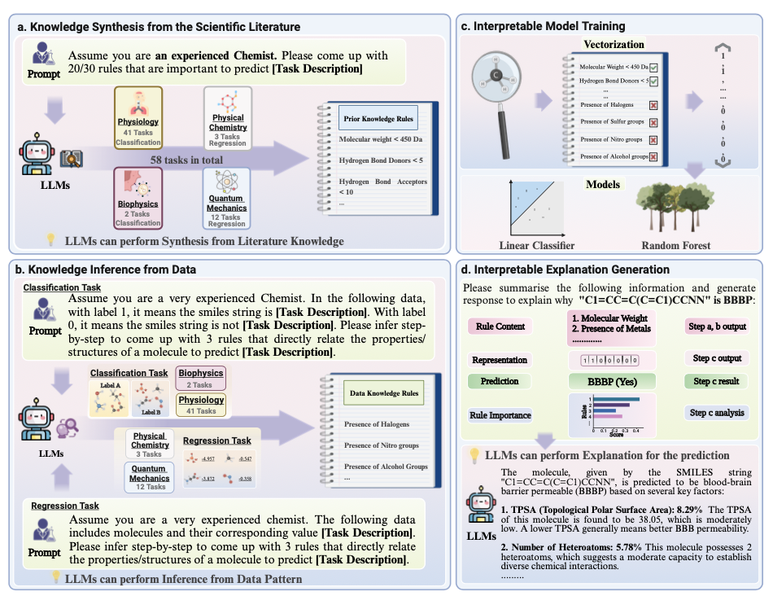

## Introduction
Welcome to my blog post, where I summarize and discuss the paper "Large Language Models for Scientific Synthesis, Inference, and Explanation" by Zheng et al. This paper investigates how large language models (LLMs), typically used for tasks in Natural language understanding and generation, can be adapted for more advanced applications in natural sciences. Authors demonstrate how LLMs can process and integrate scientific literature, extract insights, and even propose novel hypotheses, bridging gaps in understanding across diverse scientific domains.

As a Master's student in Computational Linguistics, I'm particularly interested in how general-purpose LLMs can perform augment knowledge from scientific literature and bring something new to the sciences. 

My exploration of this topic is also inspired by a presentation by the authors and additional resources that delve into the methods and implications of integrating LLMs with scientific inquiry.

## What brings this tool to science?
Currently it takes approximately 13 years to make headway in a science, since new discoveries are getting more complex and challenging. At the same time LLMs have emerged as transformative tools in various domains, being able to synthesize rules from scientific literature, make inferences and conclusions with explanations. These capabilities were harnessed in the development of the pipeline that can predict molecular properties using rules synthesized from scientific literature and inferred from data. This approach achieves state-of-the-art performance across 58 tasks, demonstrating the potential of LLMs to address challenges in the natural sciences and foster a new era of AI-assisted innovation.

## LLMs for Scientific Discovery

The introduced scientific discovery pipeline, **LLM4SD**, is consisted of four components (Fig. 1): 
1. **Knowledge Synthesis from Scientific Literature**
2. **Knowledge Inference from Data**
3. **Interpretable Model Training**
4. **Interpretable Explanation Generation**.

This workflow enables advanced molecular property prediction across 58 tasks spanning four domains: Physiology, Biophysics, Physical Chemistry, and Quantum Mechanics.

In the **Knowledge Synthesis phase**, LLMs leverage their extensive pretraining on scientific literature to deduce domain-specific rules for property prediction. Complementing this, the Knowledge Inference phase identifies patterns in datasets to generate prediction rules, akin to how scientists formulate hypotheses from observations. Both processes produce **rule-based features** that transform data into vectorized representations, essential for model training.

During the **Interpretable Model Training** step, these features are utilized to train interpretable models, such as random forests or linear classifiers, ensuring transparency and explainability of predictions. Enhanced by LLM4SD, these models outperform state-of-the-art baselines.

Finally, on the **Explanation Generation** phase, LLMs summarize decision-making mechanisms, explaining how rules and features influence outcomes.

---

By combining the strengths of human and AI capabilities, LLM4SD propels scientific discovery, offering a transparent and effective tool for researchers to explore complex phenomena and accelerate breakthroughs.

## Methods

##  Experiment Results
The LLM4SD pipeline has shown groundbreaking results across 58 tasks, outperforming state-of-the-art models, including advanced Graph Neural Networks (GNNs) like MolCLR and GraphMVP, as well as baseline methods such as Random Forests. For example, in physiology,the model raised AUC-ROC from 74.43% to 76.60%, and in biophysics, it advanced the metric from 81.7% to 83.4%. LLM4SD excelled in regression tasks too: in quantum mechanics, it reduced the mean absolute error (MAE) by 48.2%, and in physical chemistry, it achieved an 18.5% improvement over prior models. These results demonstrate the pipeline’s adaptability to diverse domains.

## Statistical Analysis and Literature Review

## Inference: Beyond Human Capacity

## Further application

## Conclusion
